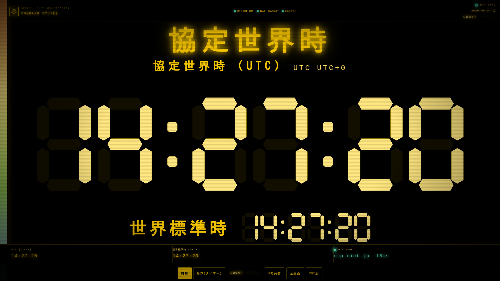

# ヤシマ作戦クロック

[](https://www.php.net/)
[](LICENSE)

エヴァンゲリオン「ヤシマ作戦」の司令室時計をモチーフにした、**日本標準時（JST）デジタル時計**です。

PHP / HTML / JavaScript のみ。データベース不要。共有サーバーに置いて開くだけです。

**非公式のファンメイドです。** NERV / エヴァンゲリオン公式とは無関係です。



---

## GitHub About に貼る文

リポジトリページ右上の ⚙️ **About** に、次をコピーしてください。

| 項目 | 内容 |
| --- | --- |
| **Description** | エヴァンゲリオン「ヤシマ作戦」風の日本標準時デジタル時計。PHP / HTML / JS。NTP 同期、共有サーバーに置くだけ。 |
| **Website** | 公開 URL（例: `https://kinokuni.ac/test/`） |
| **Topics** | `clock` `ntp` `php` `jst` `digital-clock` `evangelion` `yashima` `nerv` |

短い英語版:

```
NERV Yashima-op style JST clock. PHP/HTML/JS. NTP sync. Drop on shared hosting.
```

---

## できること

- 7セグ風の大型時計（PC は横、スマホは縦）
- 起動時の MAGI ブート演出（約 2〜3 秒）
- `clock.ini` で指定した NTP サーバから、起動のたびに時刻取得
- NTP 成功＝緑ランプ / 失敗＝赤ランプ＋端末時刻
- 世界標準時（UTC）を同時表示
- 端末のタイムゾーンに合わせた見出し（日本なら 日本標準時 / JST UTC+9）
- 活動限界タイマー（1 / 5 / 15 / 30 分）
- アクセスカウンター（右上と下バーの `COUNT`）
- X（Twitter）でこのページを共有
- `fonts/` に置いたフォントを自動読み込み

## 必要環境

- PHP 7.4 以降
- `fsockopen` で **UDP ポート 123** が使えること（NTP）
- 共有サーバーで UDP が塞がれている場合は、端末時刻になります（赤ランプ）

## 設置

1. このフォルダ一式を `public_html` またはサブフォルダへアップロードする
2. `data/` を書き込み可能にする（755 または 777）
3. ブラウザでその URL を開く
4. 更新したあとはスーパーリロード（Windows: `Ctrl+F5` / Mac: `Cmd+Shift+R`）

```
index.php          ページ本体
ntp.php            NTP 問い合わせ
clock.ini          NTP サーバ設定
lib/counter.php    アクセスカウンター
lib/fonts.php      fonts/ の自動読み込み
data/hits.txt      アクセス数（自動で増える）
assets/app.css
assets/app.js
fonts/             任意。ttf / otf / woff / woff2
LICENSE
```

GitHub から取る場合:

```bash
git clone https://github.com/<user>/yashima-clock.git
```

中身を FTP / ファイルマネージャーでサーバーへコピーしてください。

## NTP

[`clock.ini`](clock.ini) を編集して保存し、ページを再読み込みします。

```ini
[ntp]
server = ntp.nict.jp
timeout_ms = 2500
```

| サーバ | 説明 |
| --- | --- |
| `ntp.nict.jp` | 情報通信研究機構（日本標準時） |
| `ntp.jst.mfeed.ad.jp` | Internet Multifeed |
| `time.google.com` | Google Public NTP |
| `time.cloudflare.com` | Cloudflare |

ブラウザへ渡すのは **絶対時刻（Unix ミリ秒）だけ** です。レンタルサーバーが海外にあっても、サーバーの時計には合わせません。

## フォント

`fonts/` にファイルを置くと、見出しなどに自動で使います。

- 通常のフォント … 見出し・ボタン
- ファイル名に `mono` または `code` が含まれるもの … 等幅用
- `COUNT` と NTP 表示は、欠けないようシステム等幅フォント固定

何も置かなければ、端末の日本語フォントのままです。

## 操作

| 操作 | 内容 |
| --- | --- |
| 時刻 | 現在時刻 |
| 限界(タイマー) | 活動限界カウントダウン |
| Xで共有 | このページの投稿画面を開く |
| 全画面 | ブラウザのフルスクリーン |
| `F` | 全画面 |
| `Space` | タイマー開始 / 停止 |
| `1` / `2` | 時刻 / タイマー切替 |

## トラブル

| 症状 | 確認 |
| --- | --- |
| COUNT が増えない | `data/` の書き込み権限。`data/hits.txt` があるか |
| COUNT の文字が消える | EVA フォントを COUNT に当てないこと。`lib/fonts.php` を上書き |
| 時計が赤い / 端末時刻 | サーバーが NTP（UDP 123）を遮断している。`clock.ini` のホストも確認 |
| 画面が古い | スーパーリロード。`index.php` の `?v=` が変わっているか |
| 時刻がずれる | 古い JS をキャッシュしている可能性。`assets/app.js` を上書きして再読み込み |

## ライセンス・免責

コードは [MIT License](LICENSE) です。設置・改変して使って構いません。

作品の意匠・名称は原作の権利者に帰属します。非営利のファン作品として公開してください。
